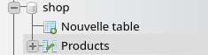
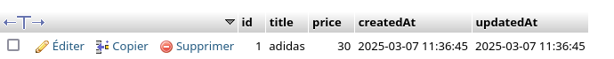

# API Rest CRUD :  Faire un serveur HTTP qui sert les données d'une base de données.
- **API** : Programme qui fait l'interface entre 2 programmes.
- **API REST** : Serveur HTTP qui fait l'interface entre le front end et des données. Grossièrement, l'API REST, c'est le back end. Ce serveur permet l'accès Oboney via des URL appelée routes. 
- **CRUD** : Create Read update Delete. Les routes minimales d'une API REST. Grossièrement si le serveur sert des produits par exemple, je dois faire le CRUD des produits et donc créer les fonctions qui me permettent de Créer, Lire, mettre à jour ou supprimer des produits. 


1. Créer une base de données 

2. Faire le CRUD du produit (Créer les fonctions qui permettent d'accéder aux produits contenus dans la base de données).
    - getAllProducts()
    - newProduct(title,price)

3. Créer les routes de l'api REST (Créez les URL qui Qui utilise les fonctions pour accéder à la base de données et renvoyer dans la Réponse HTTP, les données soient les produits. )
    - GET /all-products : Renvoi un tableau de produits 
    - POST /create-product : Renvoi le produit nouvellement créé.

## Pré-requis 

- nodejs et npm
- un server SQL (mysql, postgre,...)

Installez nodejs et npm sur votre machine si vous ne l'avez pas déjà fait.
```bash
sudo apt install nodejs npm
```

- Postman pour tester notre api rest
```bash
sudo apt install snap
sudo snap install postman
snap run postman
```

## Créer la BDD
Pour créer un crud il nous faut une base de données pour stocker les données. 

Je vous propose de créer un serveur mysql avec docker.

> Vous pouvez également créer une base de données Postgre depuis *www.supabase.com*.

### Lancer le serveur Mysql - La BDD

Créer un serveur mysql avec la commande suivante :
```bash
docker network create local
docker run --name bdd-shop --network local -d -p 3306:3306 -e MYSQL_ROOT_PASSWORD=root -e MYSQL_DATABASE=shop mysql
```

- La base de données `shop` a été crée.
- Le mot de passe de l'utilisateur *root* est *root*
- Le port 3306 (celui de mysql) est exposé sur votre machine il sera donc accessible à notre application nodejs.

### Voir les infos de la bdd avec phpmyadmin

PhpMyAdmin est une application we qui permet d'administrer une bdd Mysql depuis un navigateur plutot qu'un CLI.

Lancez une container PhpMyAdmin avec docker en précisent les identifiants de connexion de la BDD défini présedement.

```bash
docker run --name pma  --network local -d -p 8080:80 -e MYSQL_ROOT_PASSWORD=root -e PMA_HOST=bdd-shop phpmyadmin
```

Rendez-vous sur php myadmin : http://localhost:8080


Et écrivez les identifiants :
```
utilitsateur : root
password : root
```


## Coder le back-end

### Init les fichiers du projet
```bash
npm init
npm install express mysql2 sequelize cors
```

> Dans package.json ajoutez la ligne 
> `"type":"module",`
> dans l'objet JSON

### Se connecter à la BDD Mysql en JavaScript

Sequelize est une bibliotèque JavaScript qui permet d'effectuer facilement des requete vers une base de données MySQL.

Créez deux fichiers :
- `database.js` 
- et `main.js.`

*database.js*
```js
import { Sequelize } from "sequelize";

// Je défini les identifiant de connexion
const login = {
    database : "shop",
    username : "root",
    password : "root",
};

// Je crée une instance de sequelize
// et je l'export pour l'utiliser dans main.js
export  const sequelize = new Sequelize(login.database,login.username,login.password,{
    dialect:"mysql"
});
``` 

*main.js*
```js
import { sequelize } from "./database.js";

// Se connecter à la BDD
sequelize.sync({force : true}); 
```

Lancer le prgramme.

```bash
node main.js
```

Vous voyez que sequelize fait une requête par défaut pour voir si tout va bien.

```
Executing (default): SELECT 1+1 AS result
```

### Créer la table de donnée `Product`

Je crée ensuite ma table de donnée de produit.

| title | price |
|-|-|
|adidas|90|
|puma |74|

Pour ce faire j'utilise la fonction `define`.

```js
/**
 * CREATE TABLE Je défini la sctructure de la table de produit
 */
const Product =  sequelize.define("Product",{
    title : DataTypes.STRING,
    price : DataTypes.INTEGER
});
```

Code complet de la connexion à la BDD et de la table Product :

*database.js*
```js
import { DataTypes, Sequelize } from "sequelize";

/**
 * Init BDD
 */
const login = {
    database : "shop",
    username : "root",
    password : "root",
};
export  const sequelize = new Sequelize(login.database,login.username,login.password,{
    dialect:"mysql"
});

/**
 * CREATE TABLE Je défini la sctructure de la table de produit
 */
const Product =  sequelize.define("Product",{
    title : DataTypes.STRING,
    price : DataTypes.INTEGER
});
```

*main.js*
```js
import { sequelize } from "./database.js";

// Je connecte ma bdd 
// La Syncronisation lance la création de la table
sequelize.sync({force : true}).then(()=>{
    // quand la BDD est bien connecté je démarre mon programme.
    main();
});

async function main(){
    console.log("Mon programme démarre !");
}
```

> Il est important d'attendre que la BDD soit bien syncroniser avant de démarrer notre programme car notre programme dépend entierement de la BDD pour la création ou la lecture des produits.

## CRUD

### Créer un produit - la fonction newProduct()
La premiere étape du crud est la création d'une fonction de création de produit.

Je peux utiliser la fonction `Product.create()` et fournir les champs de mon produit à ajouter dans la bdd en paramètres donc:

- le titre
- le prix

```js
/**
 * Ajoute un produit à la bdd
 * @param {string} title 
 * @param {number} price 
 */
export async function newProduct(title,price){
    const newProduct = await Product.create({
        title : title,
        price : price
    });

    return newProduct;
}
```

Je peux ensuite appeler ma fonction dans le main (une fois que la bdd est bien connecté sinon je vais avoir une erreur de connexion).

*main.js*
```js
import { sequelize } from "./database.js";

sequelize.sync({force : true}).then(()=>{
    // quand la BDD est bien connecté je démarre mon programme
    main();

});

async function main(){
    await newProduct("adidas",30);
}
```

Si je vais dans phpmyadmin `http://localhost:8080` et que je regarde ma bdd shop je vais voir une table Product avec un produit dedans.





### Récupérer les produits - la fonction getAllProducts()

La second étape c'est la création d'une fonction pour récupérer mes produits

```js
export async function getAllProducts(){
    const products = await Product.findAll();
    
    return products;
}
```

Que j'utilise dans mon main également pour voir mes produits.

```js
import { getAllProducts, newProduct, sequelize } from "./database.js";

sequelize.sync({force : true}).then(()=>{
    // quand la BDD est bien connecté je démarre mon programme
    main();

});

async function main(){

    await newProduct("adidas",30);
    await newProduct("puma",98);

    const products = await getAllProducts();
    products.forEach(product=>{
        console.log(product.title);
        console.log(product.price);
    })
}
```

Résultat dans la console de nodejs :

```
adidas
30
puma
98
```

Il ne reste plus que créer un serveur http pour les rendre disponible sur le web.

## Le serveur HTTP - API REST
Nous allons créer un serveur http pour servir nos produits et permettre la création.

Pour ce faire le client devra effectuer des requêtes HTTP.

L'objectif d'une API rest est d'exposer plusieurs routes URL.

- `GET /all-products` : Pour récupérer tous les produits 
- `POST /new-product` : Pour rajouter un produit.

Je peux créer une route avec express et ses fonction get et post.

*Exemple de route.*
```js
app.get("/mon-url",async (req,res)=>{
    // Une requet est faite ! 
    // je code des truc

    // je retourne une donnée au format JSON
    res.json(data);
});
```
#### Installer Postman
Pour tester l'api rest on va avoir besoin d'un client http vous pouvez utiliser Postman.

```bash
sudo apt install snap
sudo snap install postman
snap run postman
```

### Créer la route /create-product - Ajouter un produit

*main.js*
```js
import express from "express";
import { getAllProducts, newProduct, sequelize } from "./database.js";

sequelize.sync({force : true}).then(()=>{
    // quand la BDD est bien connecté je démarre mon programme
    main();

});

function main(){
    
    const app = express();


    app.post("/create-product",async (req,res)=>{
        const product = await newProduct("adidas",30);
        res.json(product);
    })

    app.listen(3000,()=>{
        console.log("API listen on port 3000");
    });

}
```

1. Testez la route POST /create-product dans Postman et vérifiez si une produit à été ajouté dans la BDD sur phpmyadmin 

> `http://localhost:8080`

### Créer la route /all-product - Ajouter un produit

*main.js*
```js
import express from "express";
import { getAllProducts, newProduct, sequelize } from "./database.js";

sequelize.sync({force : true}).then(()=>{
    // quand la BDD est bien connecté je démarre mon programme
    main();

});

function main(){
    
    const app = express();

    app.get("/all-products",async (req,res)=>{
        const products = await getAllProducts();
        res.json(products);
    });

    app.listen(3000,()=>{
        console.log("API listen on port 3000");
    });

}
```

1. Testez la route GET /all-product dans Postman et vérifiez si vous recevez bien tout vos produits.

> `http://localhost:8080`

<!-- ### Tester l'application

Pour effectuer une requete test je peux utiliser le programme `curl`.

1. Testez si l'ajout fonctionne avec `curl`

```bash
# Je fais un POST en http
curl -X POST http://localhost:3000/new-product
```

2. Testez si la récupération des produits fonctionne avec curl
```bash
# Je fais un GET en http
curl -X GET http://localhost:3000/all-products
```

3. Tester l'application avec postman -->

## Lire le contenu de la requête POST pour ajouter un vrai produit.

Notre requête post ajoute toujours le même produit, il faut fournir dans le body de la requête HTTP un produit.

Le body de la requête se trouve dans l'objet req.body, c'est un body json, il faut donc demander à express de parser le body pour nous fournir un objet fini et utilisable.

```js
function main(){
    
    const app = express();

    app.use(express.json()); // Cette ligne parse le body JSON et créer la variable req.body

    // ...
}
```

Je peux ensuite simplement me servir du body dans la route create-product.
```js

    app.post("/create-product",async (req,res)=>{
        console.log(req.body);
        const product = await newProduct(req.body.title,req.body.price);
        res.json(product);
    })
```

Voici la ligne de commande de curl qui permet d'effecuter une requete http :
- Le type de requête en POST Pour correspondre à la route créée avec app.post.
- Le body étant une chaîne de caractères JSON.
- Le content-type étant du JSON obligatoire pour le fonctionnement d'express. 

```bash
curl --header "Content-Type: application/json" --request POST --data '{"title":"air max","price":39}'  http://localhost:3000/create-product
```
<!-- 
## Objectif

***Completer le CRUD.***

Mettez en place l'api REST pour récupérer et créer des produits dans un premier temps puis faite tout le CRUD grace au cours suivant :

- express : https://github.com/CHAOUCHI/parcours_cda/blob/master/NodeJS/Chapitre%201%20-%20Express/1%20-%20Cr%C3%A9er%20un%20back%20end%20en%20JavaScript%20avec%20NodeJS.md#ajouter-une-donn%C3%A9e-au-serveur-avec-post

- sequelize :  https://github.com/CHAOUCHI/parcours_cda/blob/master/NodeJS/Chapitre%202%20-%20Sequelize/TP%201%20-%20Persitence%20des%20donn%C3%A9es%20avec%20l'ORM%20sequelize.md -->