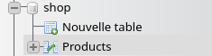
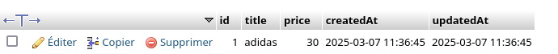

# Créer la BDD

### Lancer la BDD
```bash
docker network create local
docker run --name bdd-shop --network local -d -p 3306:3306 -e MYSQL_ROOT_PASSWORD=root -e MYSQL_DATABASE=shop mysql
```

### Voir les infos de la bdd avec phpmyadmin

```bash
docker run --name pma  --network local -d -p 8080:80 -e MYSQL_ROOT_PASSWORD=root -e PMA_HOST=bdd-shop phpmyadmin
```

Ecrivez les identifiants :
root
root

# Créer le projet

## Init les fichiers du projet
*database.js*
```bash
npm init
npm install express mysql2 sequelize cors
```

## Se connecter à la BDD en JS
```js
import { Sequelize } from "sequelize";

const login = {
    database : "shop",
    username : "root",
    password : "root",
};

export  const sequelize = new Sequelize(login.database,login.username,login.password,{
    dialect:"mysql"
});

``` 

*main.js*
```js
import { sequelize } from "./database.js";
sequelize.sync({force : true}); // Se connecter à la BDD
```

Vous voyez, il fait une requete par défaut pour voir si tout va bien.
```
Executing (default): SELECT 1+1 AS result
```

## Créer la table de donnée Product

Je créer ensuite ma table de donnée de produit.

| title | price |
|-|-|
|adidas|90|
|puma |74|

Pour ce faire j'utilise la fonction `define`.

```js
/**
 * CREATE TABLE Je défini la sctructure de la table de produit
 */
const Product =  sequelize.define("Product",{
    title : DataTypes.STRING,
    price : DataTypes.INTEGER
});
```


Code complet de l'init :

*database.js*
```js
import { DataTypes, Sequelize } from "sequelize";

/**
 * Init BDD
 */
const login = {
    database : "shop",
    username : "root",
    password : "root",
};
export  const sequelize = new Sequelize(login.database,login.username,login.password,{
    dialect:"mysql"
});

/**
 * CREATE TABLE Je défini la sctructure de la table de produit
 */
const Product =  sequelize.define("Product",{
    title : DataTypes.STRING,
    price : DataTypes.INTEGER
});
```

*main.js*
```js
import { sequelize } from "./database.js";

// Je connecte ma bdd et je crée la table
sequelize.sync({force : true}).then(()=>{
    // quand la BDD est bien connecté je démarre mon programme
    main();
});

async function main(){
    console.log("Mon programme démarre !");
}
```

# CRUD

## Create - la fonction newProduct()
La premiere étape du crud est la création d'une fonction de création de produit.

Je peux utiliser la fonction `Product.create()` et fournir les champs de mon produit à ajouter dans la bdd en paramètres donc:

- le titre
- le prix

```js
/**
 * Ajoute un produit à la bdd
 * @param {string} title 
 * @param {number} price 
 */
export async function newProduct(title,price){
    const newProduct = await Product.create({
        title : title,
        price : price
    });

    return newProduct;
}
```

Je peux ensuite appeler ma fonction dans le main (une fois que la bdd est bien connecté sinon je vais avoir une erreur de connexion).

*main.js*
```js
import { sequelize } from "./database.js";

sequelize.sync({force : true}).then(()=>{
    // quand la BDD est bien connecté je démarre mon programme
    main();

});

async function main(){
    await newProduct("adidas",30);
}
```

Si je vais dans phpmyadmin `http://localhost:8080` et que je regarde ma bdd shop je vais voir une table Product avec un produit dedans.





## getAllProducts

La second étape c'est la création d'une fonction pour récupérer mes produits

```js
export async function getAllProducts(){
    const products = await Product.findAll();
    
    return products;
}
```

Que j'utilise dans mon main également pour voir mes produits.

```js
import { getAllProducts, newProduct, sequelize } from "./database.js";

sequelize.sync({force : true}).then(()=>{
    // quand la BDD est bien connecté je démarre mon programme
    main();

});

async function main(){

    await newProduct("adidas",30);
    await newProduct("puma",98);

    const products = await getAllProducts();
    products.forEach(product=>{
        console.log(product.title);
        console.log(product.price);
    })
}
```

Résultat dans la console de nodejs :

```
adidas
30
puma
98
```

Il ne reste plus que créer un serveur http pour les rendre disponible sur le web.

# API REST

L'objectif d'une API reste est exposé plusieurs routes URL.

- GET /all-products : Pour récupérer tous les produits 
- POST /new-product : Pour rajouter un produit.

```js
import express from "express";
import { getAllProducts, newProduct, sequelize } from "./database.js";

sequelize.sync({force : true}).then(()=>{
    // quand la BDD est bien connecté je démarre mon programme
    main();

});

function main(){
    
    const app = express();

    app.get("/all-products",async (req,res)=>{
        const products = await getAllProducts();
        res.json(products);
    });

    app.post("/create-product",async (req,res)=>{
        const product = await newProduct("adidas",30);
        res.json(product);
    })

    app.listen(3000,()=>{
        console.log("API listen on port 3000");
    });

}
```


1. Testez si l'ajout fonctionne avec curl

```bash
curl -X POST http://localhost:3000/new-product
```

2. Testez si la récupération des produits fonctionne avec curl
```bash
curl -X GET http://localhost:3000/all-products
```


## Lire le contenu de la requete POST pour ajouter un vrai produit.

Notre requête post ajoute toujours le même produit, il faut fournir dans le body de la requête HTTP un produit. Nous pouvons le faire avec la commande CURL.

Le body de la requête se trouve dans l'objet req.body C'est un body jison, il faut donc demander à express de parser le body pour nous fournir un objet fini et utilisable.

```js
function main(){
    
    const app = express();

    app.use(express.json()); // Cette ligne parse le body JSON et créer la variable req.body

    // ...
```


Je peux ensuite simplement me servir du body dans la route create-product.
```js

    app.post("/create-product",async (req,res)=>{
        console.log(req.body);
        const product = await newProduct(req.body.title,req.body.price);
        res.json(product);
    })
```

Voici la ligne de commande de curl qui permet d'effecuter une requete http :
- Le type de requête en POST Pour correspondre à la route créée avec app.post.
- Le body étant une chaîne de caractères JSON.
- Le content-type étant du JSON obligatoire pour le fonctionnement d'express. 

```bash
curl --header "Content-Type: application/json" --request POST --data '{"title":"air max","price":39}'  http://localhost:3000/create-product
```

3. Verifiez si des produits sont ajoutées à la BDD avec la route `/all-products` ou phpmyadmin.

Cette commande n'est vraiment pas pratique vous pouvez telecharger un client visuel comme insomnia ou postman plutot que curl.

3. Testez ces routes avec Postman ou Insomnia.


## Objectif

***Completer le CRUD.***

Mettez en place l'api REST pour récupérer et créer des produits dans un premier temps puis faite tout le CRUD grace au cours suivant :

- express : https://github.com/CHAOUCHI/parcours_cda/blob/master/NodeJS/Chapitre%201%20-%20Express/1%20-%20Cr%C3%A9er%20un%20back%20end%20en%20JavaScript%20avec%20NodeJS.md#ajouter-une-donn%C3%A9e-au-serveur-avec-post

- sequelize :  https://github.com/CHAOUCHI/parcours_cda/blob/master/NodeJS/Chapitre%202%20-%20Sequelize/TP%201%20-%20Persitence%20des%20donn%C3%A9es%20avec%20l'ORM%20sequelize.md